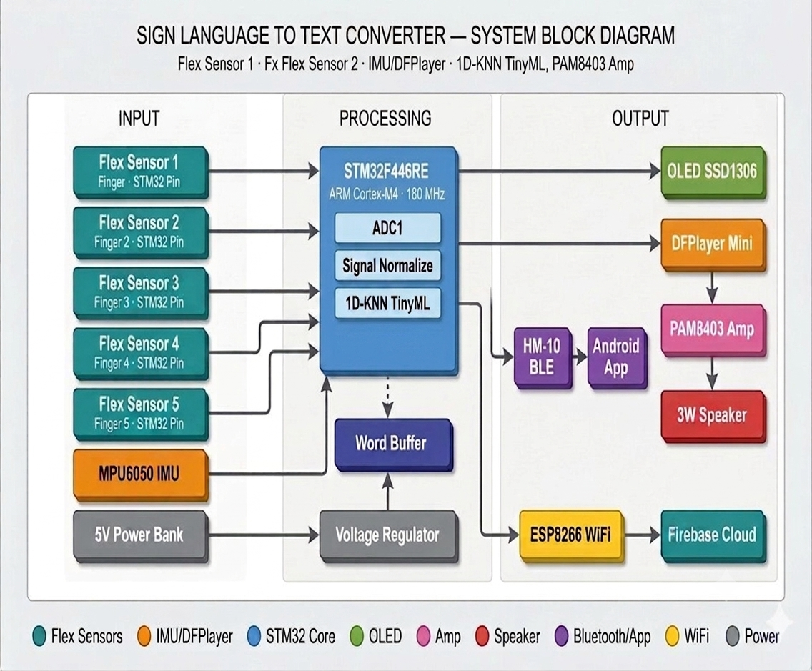

# 🤟 Sign Language to Text Converter

## 📖 Overview
This project is an STM32F446RE-based Sign Language to Text Converter that recognizes hand gestures using flex sensors and an MPU6050 IMU. The recognized gesture is converted into text and displayed on an OLED screen. It also supports Bluetooth and Wi-Fi communication for data transmission.

---

## ✨ Features
| Specification        | Details                      |
| -------------------- | ---------------------------- |
| Microcontroller      | STM32F446RE                  |
| Programming Language | Embedded C                   |
| IDE                  | STM32CubeIDE                 |
| Sensors              | 5 Flex Sensors, MPU6050      |
| Display              | SSD1306 OLED                 |
| Communication        | BLE (HM-10), Wi-Fi (ESP8266) |
| Machine Learning     | KNN                          |
| Output               | Text and Speech              |

---

## 🛠 Hardware Used
- STM32F446RE
- Flex Sensors
- MPU6050
- SSD1306 OLED Display
- HM-10 BLE Module
- ESP8266 Wi-Fi Module
- Power Supply

---

## 💻 Software Used
- STM32CubeIDE
- Embedded C
- STM32 HAL Library
- Git
- GitHub

---

## 📁 Project Structure

## 📂 Project Structure

```text
Sign-Language-to-Text-Converter
│
├── Core/
│   ├── Inc/                 # Header files
│   ├── Src/                 # Source code
│   └── Startup/             # Startup files
│
├── Drivers/
│   ├── CMSIS/               # ARM CMSIS libraries
│   └── STM32F4xx_HAL_Driver/# STM32 HAL drivers
│
├── Debug/                   # Build output files
│
├── .settings/               # STM32CubeIDE settings
├── .project                 # Eclipse project file
├── .cproject                # Build configuration
├── .mxproject               # STM32CubeMX configuration
├── STM32F446RETX_FLASH.ld   # Flash linker script
├── STM32F446RETX_RAM.ld     # RAM linker script
├── SignLanguage.ioc         # STM32CubeMX project
├── README.md                # Project documentation
├── hardware_prototype.jpg   # Hardware prototype image
└── block_diagram.png        # System block diagram
```

## 🚀 How to Build

1. Clone the repository.
2. Open the project in STM32CubeIDE.
3. Build the project.
4. Flash the firmware to the STM32F446RE.
5. Connect the hardware and power on the system.

---

## 📊 System Block Diagram



---

## 📷 Hardware Prototype


---

## 📄 License

This project is intended for educational and research purposes.

---

## 👨‍💻 Author

**Manosaran**

B.E. Electronics and Communication Engineering

Sri Shakthi Institute of Engineering and Technology
