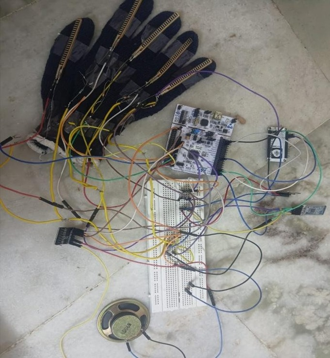

# 🤟 Sign Language to Text Converter

## 📖 Overview
This project is an STM32F446RE-based Sign Language to Text Converter that recognizes hand gestures using flex sensors and an MPU6050 IMU. The recognized gesture is converted into text and displayed on an OLED screen. It also supports Bluetooth and Wi-Fi communication for data transmission.

---

## ✨ Features
- Real-time sign language recognition
- Flex sensor-based finger detection
- MPU6050 motion sensing
- OLED text display
- Bluetooth (HM-10)
- Wi-Fi (ESP8266)
- Embedded C firmware
- STM32 HAL Drivers

---

## 🛠 Hardware Used
- STM32F446RE
- Flex Sensors
- MPU6050
- SSD1306 OLED Display
- HM-10 BLE Module
- ESP8266 Wi-Fi Module
- Power Supply

---

## 💻 Software Used
- STM32CubeIDE
- Embedded C
- STM32 HAL Library
- Git
- GitHub

---

## 📁 Project Structure

```
Core/
Drivers/
Debug/
```

---

## 🚀 How to Build

1. Clone the repository.
2. Open the project in STM32CubeIDE.
3. Build the project.
4. Flash the firmware to the STM32F446RE.
5. Connect the hardware and power on the system.

---

## 📷 Hardware Images

## 📷 Hardware Prototype



---

## 📄 License

This project is intended for educational and research purposes.

---

## 👨‍💻 Author

**Manosaran**

B.E. Electronics and Communication Engineering

Sri Shakthi Institute of Engineering and Technology
